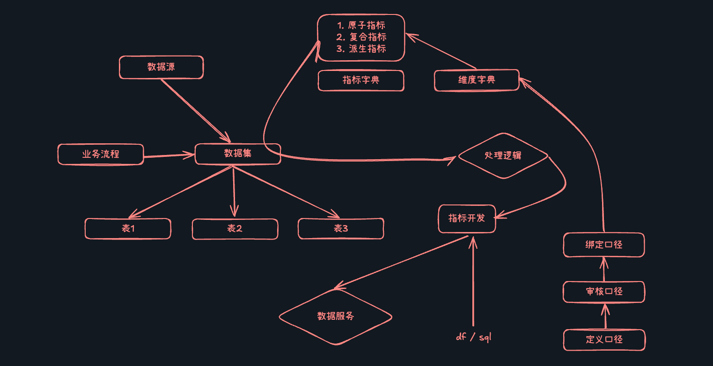

## 数据指标平台是什么

现阶段在数据处理流程中, 通常包含数据采集, 数据开发,  数据调度, 数据服务等基本环节,  在数据服务环节中一般是对外提供数仓rds相关聚合指标,  在维度上具有很大的不确定性和灵活性,  一般而言rds包含单个业务流程的业务需求维度和事实,  粒度层面上一一般都是较低级的， 这样可以为后续的指标服务环节提供很大的灵活配置方式。

## 设计灵感

这里我们着重解决如何更好并且更加灵活的方式提供数据服务能力,  我们按照需求将数据服务划分成调度类数据服务和人工类数据服务

**调度类数据服务:** 解决定期数据指标产出和报表生成的问题

**人工类数据服务:** 解决三方接入, 平台提供配置并生成指标api 并提供三方进行使用,  或临时取数需求

## 架构

## 设计取舍问题

1. 这里不关注源表和最终业务模型建设问题， 这里交由数据中台进行处理，实现采集，离线建模开发，调度问题。 这里关注点为如何利用指标层数据通过易于配置的方式进行数据服务问题。
2. 但是这里考虑能够更加使用多变的需求， 那么我们针对所有的数仓表应该都存在操作和使用的能力，所以在一定层面上需要支持更加复杂的逻辑处理， 比如结合数据分析生成最终的指标数据
3. 关于第二点，其实也考虑到在现阶段数仓可能支持相关推荐搜索或算法侧的数据使用问题， 那么需要支持对接模型算法等方式提供数据的基本处理和算法对接方案。

## 功能点设计

1. 指标管理
2. 指标生成
3. 指标调度
4. 维度管理
5. 数据服务
6. 指标报表
7. 指标监控
8. ......

## 技术栈

### 后端

1. Go
2. Gin
5. MySQL
6. Redis
8. DataFrame
9. Pandas

### 前端
1. Vue
2. WebPack
3. ElementUI

## 功能点描述

### 指标管理

### 指标生成

### 指标调度

### 维度管理

### 数据服务

### 指标报表

### 指标监控

### 数据审计

